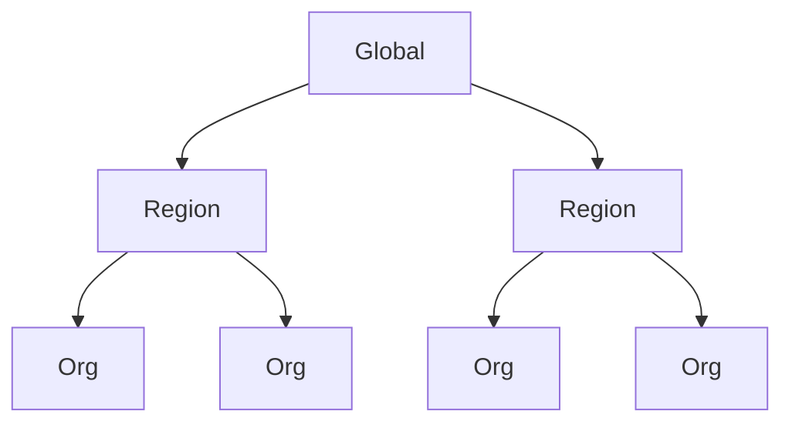

## Overview

As I transitioned from Senior Software Engineer to Technical Lead at an AI medical imaging company, one of my first major tasks was building a centralized configuration engine for medical devices and AI models.

The engine had the following functional requirements:

- **Inheritance and override** — settings should cascade from parent nodes, with child nodes able to override them.
- **Multi-level configuration** — the engine needed to support settings scoped at different levels, such as per AI model version or platform-wide.
- **Context-aware overrides** — specific settings should resolve differently depending on the requesting context. For example, in an emergency workflow only critical findings might be surfaced, while in a routine workflow all finding types would be shown.

The engine also had one critical non-functional requirement:

- **Read performance** — settings are resolved on every request in a clinical workflow, so reads had to be fast. Write performance was a secondary concern.

## High Level Design for Inheritance

Settings are organized as a tree where child nodes inherit settings from their parent. Overrides only apply at the node where they are defined — sibling nodes are unaffected.



To satisfy the read performance requirement, inheritance is resolved at write time rather than read time. When a setting is written or overridden at any node, the engine computes the fully resolved value for that node and persists it directly. This means reads are simple lookups with no traversal or computation at query time. Since settings changes are rare in practice, the cost of resolving inheritance on writes is negligible.

In addition to node-level inheritance, settings can be further overridden by context. An **emergency context** is an example of this: when a request arrives in an emergency workflow, certain settings resolve to emergency-specific values rather than the node's default. These context overrides are stored alongside the base settings and are applied at write time in the same way.

## Initial Design

The initial design, proposed by a previous technical lead, allocated a dedicated MongoDB collection for each node in the settings tree. When a node was created, it would automatically inherit all settings from its parent node.

Each node got its own collection, with settings stored as individual documents inside it:

```json
// collection: settings_root
{ "_id": "show_critical_only", "value": false, "context": null }
{ "_id": "theme", "value": "light", "context": null }

// collection: settings_root_au
{ "_id": "show_critical_only", "value": false, "context": null }
{ "_id": "theme", "value": "light", "context": null }

// collection: settings_root_us
{ "_id": "show_critical_only", "value": false, "context": null }
{ "_id": "theme", "value": "light", "context": null }
```

This approach had several significant drawbacks:

- **Index sprawl** — each new node required its own indexes, leading to an unmanageable number of collections with duplicated index definitions.
- **Poor auditability** — querying across settings required knowing specific collection names, making it difficult to trace configuration history or understand the full state of the system.
- **Cross-collection aggregations** — computing aggregated views across multiple nodes required joining data from separate collections, which MongoDB does not handle elegantly.
- **Collection count scaling** — MongoDB degrades in performance with a very large number of collections. While we never hit this ceiling in practice, the design made it an inevitable concern as the settings tree grew.
- **Migration overhead** — any schema change required running migrations against every collection, not just one. As the number of nodes grew, so did the operational burden of every migration.

## Second Design

The second design consolidated all per-node collections into a single MongoDB collection, where each node became a document. A document for the `root` node held all settings for the root node, and a document for `root.au` held all settings for the Australia node — inheriting from the `root` document above it.

All nodes now lived in a single `settings` collection, with each node's full settings embedded as a sub-document. Each setting stored both its value and the node it was derived from:

```json
// collection: settings
{
  "_id": "root",
  "settings": {
    "show_critical_only": { "value": false, "derived_from": "root" },
    "theme": { "value": "light", "derived_from": "root" }
  }
}
{
  "_id": "root.au",
  "settings": {
    "show_critical_only": { "value": false, "derived_from": "root" },
    "theme": { "value": "light", "derived_from": "root" }
  }
}
{
  "_id": "root.us",
  "settings": {
    "show_critical_only": { "value": true, "derived_from": "root.us" },
    "theme": { "value": "light", "derived_from": "root" }
  }
}
```

This resolved the collection sprawl problems but introduced new ones:

- **Large documents** — because settings were embedded as a sub-document within each node document, the documents grew very large. MongoDB must load an entire document into memory before it can read or modify any field within it.
- **Inefficient field-level queries** — querying a specific setting meant either returning the entire document and filtering in application code, or running an aggregation pipeline to project only the requested fields. Both approaches added latency, and we observed performance degradation as document sizes grew.

## Final Design

The final design decomposed the data model further: instead of one document per node, we stored one document per setting per node. Each document contained a key field identifying the setting, making it directly queryable from the backend.

Each setting for each node became its own document, with a compound index on `node` and `key` enabling direct lookups:

```json
// collection: settings
{ "node": "root",    "key": "show_critical_only", "value": false, "derived_from": "root",    "context": null }
{ "node": "root",    "key": "theme",              "value": "light", "derived_from": "root",  "context": null }
{ "node": "root.au", "key": "show_critical_only", "value": false, "derived_from": "root",    "context": null }
{ "node": "root.au", "key": "theme",              "value": "light", "derived_from": "root",  "context": null }
{ "node": "root.au", "key": "show_critical_only", "value": true,  "derived_from": "root.au", "context": "emergency" }
{ "node": "root.us", "key": "show_critical_only", "value": true,  "derived_from": "root.us", "context": null }
{ "node": "root.us", "key": "theme",              "value": "light", "derived_from": "root",  "context": null }
```

This granularity unlocked efficient index-backed queries for the three core access patterns:

- **Single setting lookup** — fetch a specific setting for a specific node by querying on node and key.
- **All settings for a node** — retrieve every setting document for a given node.
- **Settings across nodes** — fetch a particular setting across all nodes, useful for understanding how a value cascades or is overridden through the tree.

## The Cost of an Unstructured Tree

One issue that emerged independently of the data model was the lack of any enforced structure on the tree itself. Nodes could be nested to arbitrary depth with any combination of children, resulting in a tree with no defined semantics at each level.

This became a problem when we needed to implement features tied to a specific type of node. Different levels in a real-world hierarchy have meaningfully different requirements:

- An **organization node** might need to integrate with a specific SSO provider.
- A **region node** is primarily concerned with settings configuration and has no need for SSO.
- A **department node** might only require a single specific setting.

Because the tree had no enforced structure, we could never reliably know what a given node *represented*. Implementing a feature for "organization-level" nodes meant working around the ambiguity of what level a node was actually at.

In hindsight, unless truly infinite-depth flexibility is a hard requirement, I would opt for a fixed tree structure where each level has a defined type with its own schema and feature set. The flexibility of an unconstrained tree sounds appealing early on, but the implementation cost compounds quickly as the product grows.

## DocumentDB vs MongoDB — The Biggest Gotcha

We used MongoDB locally and AWS DocumentDB in production. AWS markets DocumentDB as a MongoDB-compatible drop-in replacement. In practice, it is not.

- **Missing aggregation operators** — a significant number of MongoDB aggregation pipeline operators are simply not implemented in DocumentDB. Code that works perfectly in local development can fail in production the moment it hits an unsupported stage or expression.
- **No distributed transactions** — MongoDB supports multi-document distributed transactions across replica sets. DocumentDB's transaction support is limited and does not cover the same ground, which becomes a real constraint when you need atomic writes across multiple documents.

For a more detailed view of the compatiblity issues please see here (https://www.mongodb.com/resources/compare/documentdb-vs-mongodb/compatibility)

**Yes, I acknowledge that MongoDB wrote this, but I have seen the issues that are listed in this comparison first hand.**