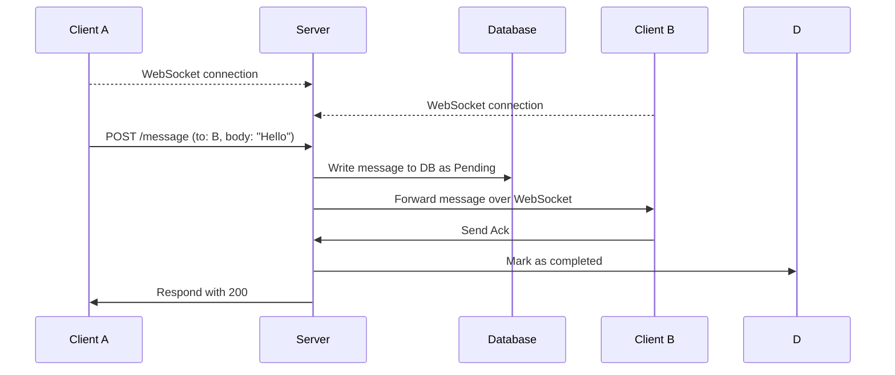
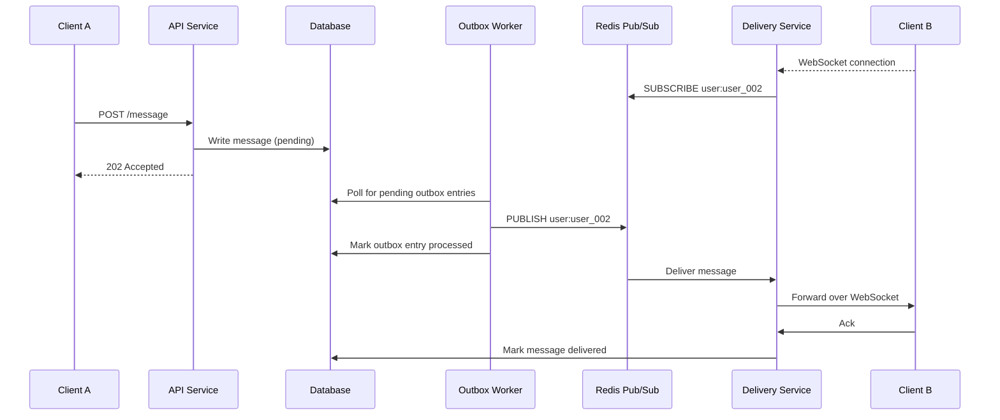
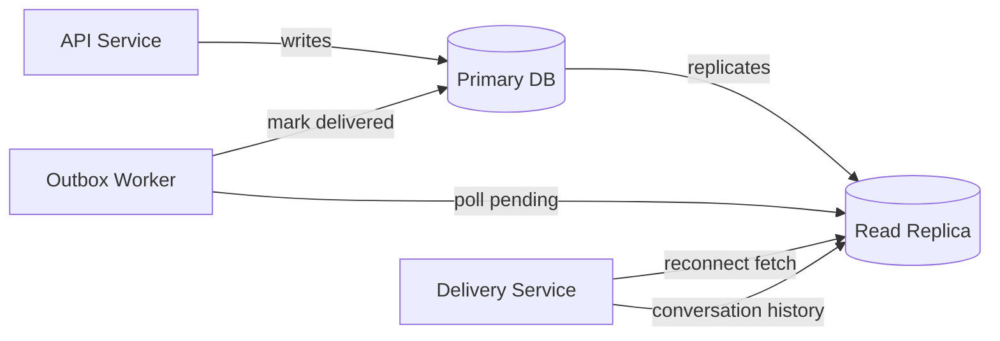
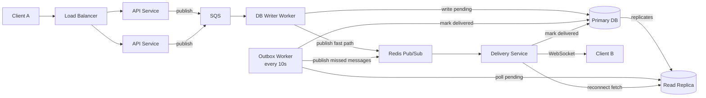

## Introduction

I recently went for an interview at a company that asked me to do a system design for a real-time messaging system. The messaging system had the following requirements. 

Functionally, it should support: 
- direct one-to-one messaging
- messages should be received in near real-time. 

The non-functional requirement were that 
- messages should always be received eventually and never be lost.
- messages should be persistent

## Initial Design

In the initial design, clients connect to a single server via WebSockets. To send a message, a client makes a POST request to the server, which first persists the message to a database, then forwards it to the recipient client over their WebSocket connection.

```json
POST /message

{
  "sender_id": "user_001",
  "recipient_id": "user_002",
  "content": "Hello!",
  "sent_at": "2026-06-03T10:30:00.000Z"
}
```

```json
DB Reprensentation

{
  "sender_id": "user_001",
  "recipient_id": "user_002",
  "content": "Hello!",
  "status": "pending"| "completed"
  "sent_at": "2026-06-03T10:30:00.000Z"
  "created_at": "2026-06-03T10:30:00.000Z"
  "updated_at": "2026-06-03T10:30:00.000Z"
}
```



## Problems with this Approach
1. Between Client A and the server — Client A sends the  POST but the server crashes before persisting to the DB.The message is gone entirely.                          
the solution to this issue is to implemnt retry logic in the client

2. Duplicate messages - lets say that the document is written to the db and marked as pending but that the connetion drops
the client would then retry and the message would be stored in the database and sent again

Solution we need to update the design to support a idempotency key like so 

```json
POST /message

{
  "message_id": "uuid"
  "sender_id": "user_001",
  "recipient_id": "user_002",
  "content": "Hello!",
  "sent_at": "2026-06-03T10:30:00.000Z"
}
```

```json
DB Reprensentation

{
  "message_id": "uuid" // unique in db
  "sender_id": "user_001",
  "recipient_id": "user_002",
  "content": "Hello!",
  "status": "pending"| "completed"
  "sent_at": "2026-06-03T10:30:00.000Z"
  "created_at": "2026-06-03T10:30:00.000Z"
  "updated_at": "2026-06-03T10:30:00.000Z"
}
```

3. **Delivery with no retry** — between the server forwarding the message and receiving the ack, the connection could drop. At that point we don't know if the message was delivered, and it stays `pending` indefinitely with no mechanism to retry.

This is the core durability gap — the DB write and the WebSocket forward are two separate unlinked operations. There is nothing bridging them to ensure delivery is ever retried.

## Second Iteration

To solve the delivery durability problem we introduce two changes: the **transactional outbox pattern** and **Redis pub/sub**.

Instead of writing to the DB and immediately forwarding, the API service writes the message and an outbox entry in a single transaction. A separate outbox worker polls for pending outbox entries, publishes them to a Redis pub/sub channel, and marks them processed. Each delivery service instance subscribes to the channels for its connected users and forwards messages over WebSocket.

This decouples durability from delivery — the DB is the source of truth, Redis is the real-time transport, and the outbox worker is the bridge between the two.




**If Client B is offline** — no delivery service is subscribed to `user:user_002`, so the Redis publish is a no-op. The message remains `pending` in the DB. When Client B reconnects, the delivery service fetches all `pending` messages for that user and delivers them in sequence order.

## Problem with the Second Iteration

If Client B is offline and multiple messages are sent, the worker could poll and publish them out of order — delivering the newest message before the oldest.

**If the delivery service crashes after forwarding but before marking delivered** — the message stays `pending` and the outbox worker retries. Client B may receive it twice through.

The fix is to always poll in `sequence_id` ascending order so messages are published and delivered in the order they were originally sent:

```sql
SELECT * FROM messages 
WHERE status = 'pending' 
ORDER BY sequence_id ASC
```


```json
DB Reprensentation

{
  "message_id": "uuid" // unique in db
  "sender_id": "user_001",
  "sequence_id": 1234, // autoincrement
  "recipient_id": "user_002",
  "content": "Hello!",
  "status": "pending"| "completed"
  "sent_at": "2026-06-03T10:30:00.000Z"
  "created_at": "2026-06-03T10:30:00.000Z"
  "updated_at": "2026-06-03T10:30:00.000Z"
}
```

`created_at` timestamps are not reliable for ordering as two concurrent writes can share the same millisecond. The auto-incrementing `sequence_id` per conversation is the only guaranteed ordering mechanism.

To prevent duplicates we can look at storing the last updated sequence_id in a seperate

## Read Replica

At scale, reading and writing to the same DB instance causes contention — the outbox worker and delivery service are constantly writing status updates while clients are reading conversation history from the same instance.

The fix is to introduce a **read replica**:

- **Primary DB** — handles all writes (new messages, status updates from the delivery service)
- **Read replica** — handles all reads (outbox worker polls, reconnect fetches, conversation history)

Both the outbox worker poll and the reconnect fetch go to the replica. This is safe because they cover each other:

1. Client B reconnects and fetches all `pending` messages from the replica — picking up everything that has replicated so far
2. Any messages written after the reconnect fetch that haven't replicated yet will be picked up by the outbox worker's next poll cycle
3. Those get published to Redis and delivered to Client B over the already-open WebSocket connection

The only effect of replication lag is a small delay on very recent messages, which is acceptable — the system guarantees eventual delivery, not instantaneous delivery.




## Final Design

To handle traffic spikes without overloading the DB writer, we introduce a durable queue (SQS) between the API service and a DB writer worker. We also add a load balancer in front of the API service to distribute traffic across multiple instances.

The API service is now fully stateless — it just publishes to SQS and returns `202 Accepted` immediately. The DB writer worker consumes from SQS at a rate the DB can handle, providing natural backpressure during spikes. If the DB writer falls behind, messages buffer in SQS rather than causing write pressure on the DB.

There are two delivery paths: a **fast path** for real-time delivery and a **safety net** for missed messages.

After writing to the DB, the DB writer publishes the message directly to Redis pub/sub. The delivery service is subscribed to the recipient's channel and forwards it to Client B immediately over WebSocket. This is the primary real-time delivery path.

The outbox worker runs on a schedule (every ~10 seconds) and polls the read replica for any messages still `pending`. These are messages the fast path failed to deliver — Client B was offline, the delivery service crashed, or the Redis publish was missed. The outbox worker publishes these to Redis and the delivery service delivers them once Client B is connected.



The full end-to-end flow:

1. Client A sends `POST /message` to the load balancer
2. API service publishes the message to SQS and returns `202 Accepted`
3. DB writer consumes from SQS, writes the message to the primary DB as `pending`, then publishes to Redis
4. Delivery service receives from Redis and forwards to Client B over WebSocket
5. Client B acks → delivery service marks the message `delivered` on the primary
6. Every 10 seconds, the outbox worker polls the replica for any still-`pending` messages and republishes them to Redis as a catch-up

The final design combines all the fixes from each iteration:

- **Load balancer** distributing traffic across multiple stateless API service instances
- **SQS** buffering writes between the API service and DB writer, handling traffic spikes
- **Client-side retries** with a `message_id` idempotency key to handle failures and prevent duplicates
- **Messages table** with `status` and `sequence_id` as the source of truth for durability and ordering
- **DB writer publishes to Redis** for real-time delivery immediately after the DB write
- **Outbox worker** running every ~10 seconds as a safety net, picking up any messages the fast path missed
- **Redis pub/sub** as the real-time transport for online clients
- **Read replica** handling all reads, with the outbox poll and reconnect fetch together ensuring no messages are ever missed